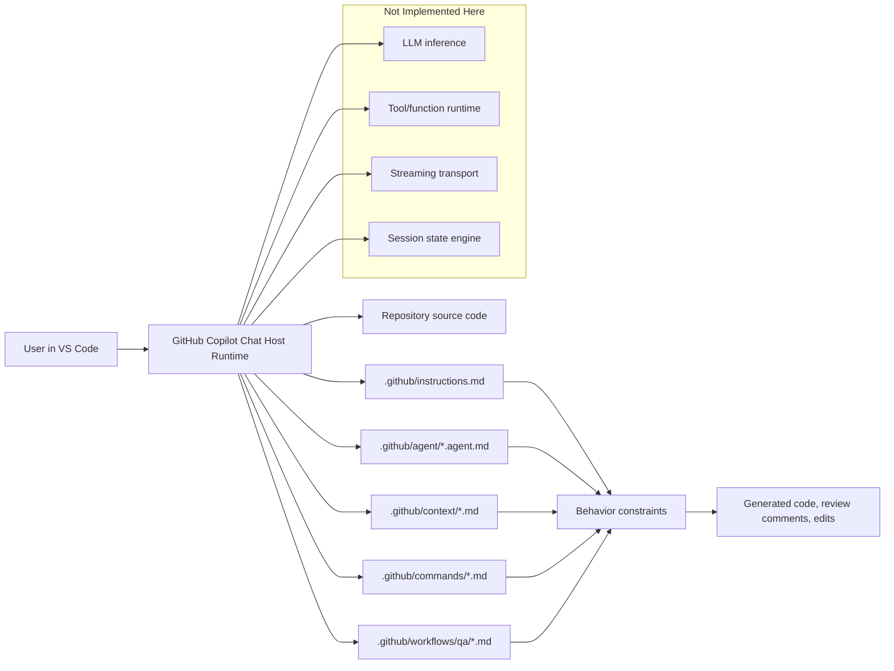
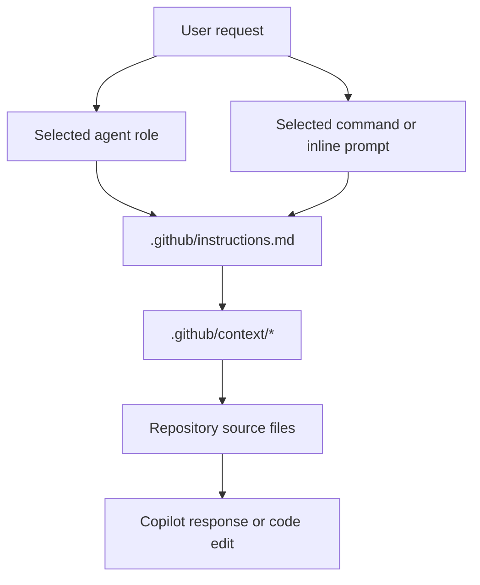
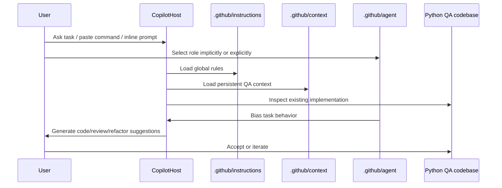

# AI Agent Framework Intelligence Report

## 1. Executive Finding

This repository does **not** contain a standalone AI agent runtime in the usual sense. There is no local implementation of an LLM gateway, tool registry, planner, executor, vector memory store, browser controller, orchestration loop, or agent state machine.

What it **does** implement is a **repository-local AI control plane for GitHub Copilot in VS Code**.

The AI system in this repository is built from five layers:

1. **Global instruction injection** in `.github/instructions.md`
2. **Role-specialized agent descriptors** in `.github/agent/*.agent.md`
3. **Persistent domain/rule context packs** in `.github/context/*.md`
4. **Reusable prompt-command registry** in `.github/commands/*.md`
5. **Workflow templates and conventions** in `.github/workflows/qa/*.md` and `.github/schema/conventions.yaml`

The host platform, not this repository, provides:

- model selection and execution
- chat/session runtime
- tool invocation and code editing primitives
- token budgeting and streaming transport
- any hidden planner/executor loop Copilot may use internally

This repository therefore represents a **prompt-governed, semi-autonomous, IDE-hosted agent framework** rather than a fully self-contained agent application.

## 2. What the AI Agent System Does

The AI layer exists to steer GitHub Copilot toward consistent enterprise API QA automation output for this codebase.

Its real-world purpose is to solve four problems that raw chat prompting does poorly:

1. **Consistency drift**
	Raw prompts vary by engineer. The repo standardizes expectations through persistent instructions and context files.

2. **Framework non-compliance**
	Without repository-local rules, an LLM may generate tests that ignore fixtures, markers, naming conventions, environment handling, and reporting requirements.

3. **Prompt repetition cost**
	The repo moves stable guidance into `.github/context/` and `.github/instructions.md`, reducing the need to restate architecture and standards in every request.

4. **Specialization without model retraining**
	The repo creates QA-specific, API-specific, and review-specific agent roles using lightweight markdown descriptors rather than code.

The result is an AI-assisted engineering environment tuned for:

- pytest API test generation
- validation design
- security and auth scenario generation
- framework review and cleanup
- enterprise QA workflow acceleration

## 3. Architecture Classification

### 3.1 Agent type

This repository implements a **hosted prompt-orchestration framework** with the following properties:

| Dimension | Classification | Evidence |
|---|---|---|
| Runtime model | Host-managed | No local LLM runtime, no inference code, no SDK clients |
| Agent architecture | Role-based multi-agent catalog over a single active host agent | `.github/agent/qa.agent.md`, `api-test.agent.md`, `review.agent.md` |
| Autonomy level | Semi-autonomous | User selects prompt/agent/file context; AI generates or edits code, but no autonomous daemon or job loop exists |
| Planning model | Prompt-defined, not code-defined | `.github/workflows/qa/feature.md` and command files specify ordered tasks |
| Memory model | Static repository memory, not runtime memory | `.github/context/agent-memory-rules.md` |
| Tooling model | Externalized to Copilot/VS Code | No tool schemas or local function-calling runtime |
| Reflection model | Role-separated review pass | `review.agent.md`, `.github/commands/review.md` |

### 3.2 Single-agent vs multi-agent

This is **not** a multi-agent runtime with inter-agent messaging. There is no orchestrator dispatching work across live agent processes.

Instead it is a **multi-agent prompt surface**:

- `qa.agent.md` defines a general QA authoring persona
- `api-test.agent.md` narrows behavior to REST/auth/schema/contract testing
- `review.agent.md` defines a critique/review persona

Only one agent persona is effectively active in a user interaction at a time. Agent switching is a **host/UI selection concern**, not an internal runtime concern.

### 3.3 Planner-executor pattern

There is no implemented `plan()` or `execute()` method in local code.

However, a **soft planner-executor pattern** exists in content form:

- **Planning artifacts**: `.github/commands/*.md`, `.github/workflows/qa/feature.md`
- **Execution constraints**: `.github/instructions.md`, `.github/context/*.md`
- **Review/reflection stage**: `.github/agent/review.agent.md`, `.github/commands/review.md`

This is a documentation-driven planner rather than a code-driven planner.

## 4. System Boundary: What Is in Repo vs Outside Repo

This boundary is the central architectural truth of the repository.

## 5. Equivalent Directory Mapping

The request asked for AI-agent directories such as `/agents`, `/tools`, `/memory`, `/planner`, `/executor`, `/llm`, `/orchestrator`, `/api`, `/ui`, and `/browser`.

Those directories do **not** exist here. The nearest equivalents are below.

| Requested layer | Actual equivalent in this repository | Status |
|---|---|---|
| `/agents` | `.github/agent/` | Implemented as markdown role descriptors |
| `/prompts` | `.github/commands/`, `.github/instructions.md`, `promptpractices.md` | Implemented |
| `/memory` | `.github/context/agent-memory-rules.md` and other context packs | Static memory only |
| `/workflows` | `.github/workflows/qa/feature.md` | Implemented as prompt workflow template, not runnable CI |
| `/config` | `.github/schema/conventions.yaml` plus repo runtime `config/` | Implemented |
| `/tools` | No local equivalent | Absent; externalized to host |
| `/planner` | No code module; planning expressed in commands/workflow markdown | Absent as code |
| `/executor` | No local equivalent | Absent |
| `/orchestrator` | No local equivalent | Absent |
| `/llm` | No local equivalent | Absent |
| `/browser` | No local equivalent | Absent |
| `/api` | Runtime test target code exists, not AI API layer | Indirect only |
| `/ui` | No custom UI | Absent |
| `/services` | No AI services layer | Absent |
| `/core` | No AI core package | Absent |
| `/tests` | `tests/` validates the QA framework target, not the AI system itself | Present but not AI-runtime tests |

## 6. Folder-by-Folder Reverse Engineering

## 6.1 `.github/agent/`

### Purpose
Defines agent personas that shape how Copilot should behave for different tasks.

### Files

| File | Responsibility | Architectural significance |
|---|---|---|
| `qa.agent.md` | General QA generation role | Baseline authoring persona for automation work |
| `api-test.agent.md` | REST/auth/schema/contract focus | Task specialization for API-specific generation |
| `review.agent.md` | Critique/review pass | Reflection substitute and quality gate persona |

### Internal behavior model
These files are intentionally minimal. They do not encode algorithms. They encode **role priors**.

That makes them low-cost to maintain but also low-expressiveness. The system relies on the host agent to interpret them as behavioral bias rather than executable instructions.

### Interactions
- Activated via Copilot/IDE agent selection
- Combined with `.github/instructions.md`
- Refined by `.github/context/*.md`

### Architectural tradeoff
- **Strength**: simple specialization without code
- **Weakness**: no deterministic routing, no structured capabilities map, no formal agent contract

## 6.2 `.github/commands/`

### Purpose
Implements a reusable prompt-command library. This is the closest thing in the repo to a task planner or tool invocation surface.

### Files and roles

| File | Responsibility |
|---|---|
| `api-testing.md` | API test generation, negative tests, auth checks, validators |
| `framework.md` | framework-level analysis, config/reporting/CI generation |
| `review.md` | review prompts for assertions, fixtures, duplication, token efficiency |
| `security.md` | security prompt set for auth/token/RBAC validation |
| `workflow-validation.md` | prompts for stage transitions, concurrency, SLA, notifications |
| `README.md` | explains command-library usage pattern |

### Why this exists
This directory externalizes common user intents into stable command text so engineers do not repeatedly invent prompts.

### Architectural significance
This is effectively a **manual prompt registry**. In a code-native agent platform, these would be structured tasks or callable skills. Here they are human-triggered prompt macros.

### Execution dependency chain
`User selects command -> Host chat session -> instructions/context injection -> repository analysis -> generated output`

### Limitations
- no parameter schema
- no validation layer
- no tool-binding metadata
- no automatic routing from command to role file

## 6.3 `.github/context/`

### Purpose
Acts as persistent policy memory and domain grounding.

### Key files

| File | Role |
|---|---|
| `agent-memory-rules.md` | persistent framework memory and AI behavior constraints |
| `framework-rules.md` | structural conventions and environment/reporting rules |
| `testing-rules.md` | coverage expectations and required validation categories |
| `backend-api.md` | versioning/auth/performance/logging expectations |
| `security-rules.md` | secrets/auth/RBAC restrictions |
| `token-optimization-rules.md` | prompt-budget and minimal-delta behavior |
| `automation-architecture.md` | target framework layer model |
| `api-contract-rules.md` | contract/schema/backward compatibility expectations |
| `workflow-validation-rules.md` | workflow, RBAC, notifications, audit expectations |
| `test-data-rules.md` | test independence and data isolation |
| `stub-framework-rules.md` | requirements for offline stubs and mock responses |
| `environment-rules.md` | environment-driven switching requirements |
| `response-standards.md` | output quality requirements |
| `reporting-rules.md` | currently empty placeholder |
| `rtl-ui-rules.md` | domain-specific expansion for UI RTL validation |
| `skills.md` | declared enterprise testing skill inventory |

### How memory works here
There is no `memory.save()` or `memory.retrieve()` implementation.

Instead, memory is expressed as **static durable text** that the host AI can ingest during repository-aware conversations. `agent-memory-rules.md` is the clearest example: it encodes what should persist "across all tasks".

This is **repository memory**, not conversational memory.

### Architectural significance
This directory is the highest-value AI layer in the repo. It functions as:

- policy engine
- style guide
- domain ontology
- safety filter
- task grounding corpus

### Tradeoffs
- **Strength**: zero-runtime-cost memory and strong behavior consistency
- **Weakness**: no retrieval ranking, no freshness scoring, no per-session writeback, no vector search

## 6.4 `.github/workflows/`

### Purpose
Despite the name, this directory does **not** contain executable CI workflow YAML.

### Actual content
- `qa/feature.md`: a human-readable AI task workflow template

### Why it matters
The file encodes a recommended plan:

1. analyze framework
2. reuse fixtures/utilities
3. generate tests
4. add markers
5. add schema validation
6. add negative scenarios
7. add edge cases
8. produce report-ready tests

This is a **workflow specification for prompting**, not a runnable automation pipeline.

### Architectural implication
The repository uses markdown to simulate orchestration stages, but there is no scheduler, queue, or pipeline runner attached to it.

## 6.5 `.github/schema/`

### Purpose
Stores AI-relevant conventions in structured form.

### File
- `conventions.yaml`

### What it provides
- file naming policy
- supported markers
- report expectations
- coverage target
- API versioning/auth assumptions

### Significance
This is the only structured configuration artifact in the AI layer. It suggests an evolution path toward machine-readable prompt contracts, but the current system still relies mostly on markdown prose.

## 6.6 `promptpractices.md`

### Purpose
Human operations manual for using the AI system.

### Why it exists
The framework is only effective if users know how to activate it. This file documents the operating model:

- copy command -> paste into Copilot Chat
- select code -> use inline chat
- reference `.github/context/*` indirectly via repository-aware chat

### Architectural significance
This file reveals the system is **human-orchestrated**. It is the missing UI layer in documentation form.

## 6.7 Runtime target directories the AI is designed to operate on

The AI layer is not useful in isolation; it is aimed at these implementation surfaces:

| Directory | Significance to AI framework |
|---|---|
| `config/` | Environment and client primitives the AI is instructed to reuse |
| `tests/` | Primary generation/editing target |
| `handlers/` | Mock-server route behavior the AI should align tests with |
| `mock-server/` | Offline API substrate the AI can leverage for deterministic QA |
| `mock-responses/` | Source of stub payload truth for offline testing |
| `test_data/` | Externalized payload libraries the AI is expected to reuse |

This is an important distinction: the AI framework lives in `.github`, but its operational effect lands in the Python QA framework.

## 7. Prompt Hierarchy and Injection Model

The effective prompt is assembled from multiple layers.

### Prompt layers in order of influence

1. **User intent**
	The immediate task request or inline instruction.

2. **Agent role**
	`qa.agent.md`, `api-test.agent.md`, or `review.agent.md` biases the persona.

3. **Global instruction layer**
	`.github/instructions.md` imposes non-negotiable framework constraints.

4. **Persistent context pack**
	`.github/context/*.md` supplies domain memory, validation rules, performance targets, and safety boundaries.

5. **Live repository grounding**
	The host agent inspects current files and should reuse local patterns.

### Dynamic prompt evolution
The prompts evolve at execution time by mixing:

- selected command text
- role bias
- repo context
- user-selected code region in inline chat
- current files under analysis

There is no local code assembling these prompts, but the documentation strongly indicates this is the intended host behavior.

## 8. How Agents Think, Plan, Execute, and Communicate

## 8.1 Thinking

There is no visible local reasoning loop such as `reason() -> observe() -> act()`.

The repository approximates "thinking" by constraining the host AI to:

- inspect existing implementation first
- generate delta changes only
- reuse fixtures/helpers/utilities
- preserve architecture consistency
- validate status/schema/security/reporting requirements

This is encoded primarily in:

- `.github/instructions.md`
- `.github/context/agent-memory-rules.md`
- `.github/context/token-optimization-rules.md`

## 8.2 Planning

Planning is represented through markdown workflows and command sets, not code:

- `feature.md` supplies ordered work stages
- `framework.md` defines higher-level maintenance tasks
- `api-testing.md` decomposes common API test generation tasks

This creates a **declarative planning surface**.

## 8.3 Execution

Execution is delegated to the Copilot host. Locally, the repository only supplies constraints and intent templates.

Execution inside the repo means one of three things:

1. generating/editing Python tests
2. reviewing existing tests
3. synthesizing framework improvements

## 8.4 Communication

Communication channels are human-facing:

- chat prompts
- inline code actions
- generated code edits
- review feedback

There is no inter-agent protocol, no event bus, and no message queue.

## 9. Tool Calling and Function Calling Analysis

## 9.1 Local implementation status

No local implementation was found for:

- tool registry
- function schema definitions
- JSON tool call protocol
- action dispatcher
- browser action API
- task execution queue

## 9.2 What exists instead

The repo uses **prompt-native pseudo-tools**. Commands such as:

- "Generate API Tests"
- "Generate Security Tests"
- "Review Assertions"
- "Generate Retry Logic"

behave like manually triggered tools, but they are not machine-callable functions.

## 9.3 Architectural conclusion

Tool calling is **entirely externalized**. If Copilot internally supports tool use, that capability is not configured or extended by this repository.

## 10. Memory, Context, and State Management

## 10.1 Memory model

Three memory forms are present conceptually:

| Memory type | Implementation |
|---|---|
| Repository memory | `.github/context/*.md` |
| Operating guidance | `.github/instructions.md` |
| Human procedural memory | `promptpractices.md` |

What is missing:

- session memory store
- vector memory
- learned feedback persistence
- per-task scratchpad persisted by code

## 10.2 State model

There is no serialized agent state.

State lives externally in the host environment and informally in:

- current chat session
- selected file/selection in VS Code
- repository files

## 10.3 Context window management

The only explicit token/context strategy in-repo is **minimize prompt size and generate delta changes only** via `token-optimization-rules.md`.

This is a soft context management approach. No local chunking, summarization, truncation, or retrieval logic is implemented.

## 11. Reflection and Self-Correction

This repository has a **manual reflection architecture**.

Reflection is implemented as a distinct persona and command family:

- `review.agent.md`
- `.github/commands/review.md`

This means self-correction is expected to happen as a second pass:

`generation pass -> review pass -> user accepts or requests revision`

There is no automatic judge loop, no confidence scoring, and no retry-on-failure execution logic.

## 12. LLM Integration Deep Dive

## 12.1 What can be stated from code

The repository clearly targets **GitHub Copilot in VS Code**. Evidence:

- `promptpractices.md` explicitly instructs users to copy prompts into Copilot Chat and use inline chat (`Ctrl + I`)
- `.github/agent/*` and `.github/instructions.md` are structured as Copilot customization artifacts

## 12.2 What is not implemented locally

No code was found for:

- OpenAI/Azure OpenAI/Anthropic/Gemini SDK calls
- model abstraction classes
- provider failover
- temperature configuration
- structured output parsing
- token accounting
- streaming handlers

## 12.3 Practical interpretation

The repository depends on the host platform for all LLM concerns. Its contribution is limited to **prompt and policy shaping**.

## 12.4 System prompt vs runtime prompt

Approximate mapping:

| Prompt type | Local artifact |
|---|---|
| System-like repo instructions | `.github/instructions.md` |
| Persistent context | `.github/context/*.md` |
| Role prompt | `.github/agent/*.agent.md` |
| User/runtime task prompt | `.github/commands/*.md` or ad-hoc chat input |

## 12.5 Structured output / JSON schema handling

No AI-side structured output parsing is implemented. The only structured conventions artifact is `.github/schema/conventions.yaml`, which behaves as a style/config declaration, not a runtime parser contract.

## 13. Method-Level Documentation: What Exists and What Does Not

The request asked for methods such as `run()`, `execute()`, `plan()`, `invoke()`, `chat()`, `callTool()`, `step()`, `observe()`, `reason()`, `reflect()`, `memory.save()`, `memory.retrieve()`, and `agent.loop()`.

### Critical result
No equivalent AI-runtime methods are implemented in this repository.

That absence is itself architecturally important: the system is **configuration-driven, not runtime-driven**.

### Closest functional equivalents

| Desired runtime method | Closest repo equivalent | Meaning |
|---|---|---|
| `plan()` | `.github/workflows/qa/feature.md` | Ordered task decomposition template |
| `execute()` | Copilot host acting on command/instruction/context pack | Externalized |
| `reflect()` | `review.agent.md` + `commands/review.md` | Manual critique loop |
| `memory.retrieve()` | `.github/context/*.md` inclusion during repo-aware prompting | Static retrieval |
| `memory.save()` | Editing context files by humans | Manual persistence |
| `callTool()` | Copying a command prompt into chat | Human-triggered pseudo-tool |

### Consequence
Any contributor expecting a debuggable local agent loop will not find one. The control plane is declarative content, not executable orchestration code.

## 14. Execution Flow End-to-End

### Flow characteristics
- human initiated
- repository grounded
- policy constrained
- externally executed
- optionally reviewed via second-pass persona

## 15. Interaction with the Python QA Framework

Although the AI layer is not executable code, it is tightly coupled to the Python automation framework.

### High-value runtime modules the AI is designed to reason about

| Module | Why the AI context references it |
|---|---|
| `conftest.py` | central reusable fixture entrypoint |
| `config/environments.py` | environment-driven behavior that prompts insist on preserving |
| `config/http_client.py` | centralized API client AI should reuse |
| `tests/auth/serh_auth_api.py` | wrapper layer AI should extend instead of calling HTTP directly everywhere |
| `tests/auth/auth_test_helpers.py` | shared assertions/utilities AI should reuse |
| `handlers/auth.py` | source of mock-side auth semantics for offline QA alignment |
| `mock-server/server.py` | offline execution substrate referenced by stub-framework rules |

### Why this matters
The AI framework is only credible because it is paired with an already modular target codebase. The prompts are written assuming reusable fixtures, centralized config, and shared helpers already exist.

## 16. Requested AI Features: Presence Matrix

| Feature | Status in repo | Notes |
|---|---|---|
| Multi-agent architecture | Partial | Multiple personas exist, but no runtime inter-agent coordination |
| Autonomous behavior | Partial | AI can generate with limited independence, but workflow is user-driven |
| Planner-executor loop | Partial | Prompt/workflow docs only |
| Tool calling | No local implementation | Host-provided only |
| Function calling | No local implementation | No schemas or dispatcher |
| Prompt chaining | Yes, implicit | instructions + context + agent + command + live repo |
| Reflection/self-correction | Partial | review persona and commands, manual loop |
| Memory implementation | Partial | static repository memory only |
| RAG | Minimal/manual | repo-aware grounding, not vector retrieval |
| Vector DB | Absent | none found |
| Embedding pipeline | Absent | none found |
| Context window management | Minimal | token-optimization rules only |
| Conversation/session management | External | Copilot host concern |
| State persistence | Static only | markdown context files |
| Event-driven workflows | Absent | no bus, no events, no queue |
| Queue/job execution | Absent | none found |
| Streaming | External | not implemented locally |
| Async execution | Absent in AI layer | runtime QA code uses normal Python execution only |
| Retry/error recovery | Partial | only as generated task idea in commands, not AI runtime logic |
| Human-in-the-loop | Strongly present | fundamental operating model |
| Safety/guardrails | Strongly present | secrets/auth/token/minimal-delta rules throughout context pack |

## 17. Infrastructure and Engineering Assessment

## 17.1 Backend architecture

There is no separate backend for the AI system. The only executable backend code in-repo is the Python QA framework and its mock server.

## 17.2 Frontend/UI architecture

No custom UI exists. The user interface is GitHub Copilot Chat / Inline Chat in VS Code, documented via `promptpractices.md`.

## 17.3 API layer

No AI API layer exists. The repo contains API test framework code, not AI service endpoints.

## 17.4 Authentication and authorization

No AI-layer auth exists. Security guidance focuses on the APIs under test and on preventing secret exposure in generated artifacts.

## 17.5 Database / cache / Redis / vector store

None found for the AI framework.

## 17.6 WebSocket / streaming

Not implemented in repo.

## 17.7 Docker / deployment / CI-CD

- No Dockerfile found for AI runtime
- No executable GitHub Actions workflow YAML found under `.github/workflows/*.yml`
- `feature.md` is guidance, not deployment automation

## 17.8 Observability

No AI-layer logging/tracing pipeline exists. Observability expectations focus on generated test code logging request URL, payload, response, and response time.

## 17.9 Cost optimization

The only explicit cost optimization strategy is token minimization:

- analyze first
- change only impacted sections
- avoid repeated boilerplate
- reuse existing helpers

This is prompt-efficiency optimization, not runtime cost-control instrumentation.

## 18. Development Maturity and Repository Intelligence

## 18.1 Maturity level

The AI framework is **medium maturity as a prompt governance system** and **low maturity as a standalone agent platform**.

### Why medium maturity
- consistent directory structure for instructions, agents, commands, and context
- reasonably coherent standards language
- domain specialization is already present
- prompt usage guide exists

### Why low maturity as platform code
- no executable orchestration layer
- no structured tool/plugin system
- no test suite for the AI control plane
- mostly prose, little machine-readable configuration

## 18.2 Coding standards and architectural consistency

The prompt/control-plane files are consistent in intent, but not equally mature:

- most files are terse rule lists
- agent descriptors are very thin
- reporting-rules is empty
- schema is minimally structured

This indicates a repository that is evolving through prompt accretion rather than through formal platform design.

## 18.3 Technical debt

Main AI-layer debt:

1. heavy reliance on prose instead of structured machine-readable specs
2. no executable validation that prompts and context remain internally consistent
3. no deterministic mapping between commands and agent personas
4. no local simulation/test harness for AI behavior
5. empty or placeholder files suggesting unfinished standardization

## 18.4 Experimental modules

The strongest signs of experimentation are:

- `.github/workflows/qa/feature.md` using a workflow directory for markdown-only procedural guidance
- `.github/schema/conventions.yaml` suggesting structured governance that has not yet expanded
- `promptpractices.md` acting as a human operational layer outside any formal automation

## 18.5 Security risks

The prompt layer itself is safety-conscious, but there are structural risks:

- safety depends on host adherence to markdown rules, not enforced code checks
- no validation that generated outputs obey secret-handling rules
- no sandbox or policy engine in repo

## 18.6 Performance bottlenecks

There are no runtime AI bottlenecks because there is no AI runtime here. The likely productivity bottlenecks are:

- users manually selecting prompts and agents
- large amounts of rule text potentially diluting specificity
- lack of structured retrieval prioritization among context files

## 18.7 Extensibility quality

Extensibility is good at the **prompt surface** level:

- add new agent persona markdown
- add new domain rule files
- add new prompt commands
- add new conventions in YAML

Extensibility is weak at the **runtime** level because there is no local runtime to extend.

## 19. Strengths, Weaknesses, Tradeoffs

### Strengths
- clean separation between global instructions, role prompts, and persistent context
- low-cost way to specialize Copilot for enterprise QA work
- human-friendly operational model
- strong emphasis on reuse, security, and minimal delta generation
- domain-aware expansion for auth, workflow, contract, SLA, RTL, and enterprise integrations

### Weaknesses
- not a self-contained AI platform despite appearing agent-oriented
- no executable planner, tool runtime, or memory store
- no AI-system tests
- heavy dependence on undocumented host behavior
- sparse agent files reduce determinism and explainability

### Architectural tradeoff
This design deliberately chooses **cheap governance over expensive platform engineering**.

That is efficient for teams already standardized on GitHub Copilot, but it caps autonomy and observability.

## 20. Recommended Evolution Path

If the goal is to mature this into a real internal AI agent platform, the next concrete steps would be:

1. Replace markdown-only commands with machine-readable task specs.
2. Add explicit command-to-agent routing metadata.
3. Expand `conventions.yaml` into a full prompt/config contract.
4. Add prompt regression tests that validate required rules are present and non-conflicting.
5. Introduce a local orchestration shim if deterministic tool use or planning is required.
6. Implement structured memory rather than relying only on static rule files.
7. Add runnable CI to validate the AI control-plane artifacts.

## 21. Bottom Line

The repository's "AI agent system" is best understood as a **repository-scoped prompt orchestration framework for GitHub Copilot**.

It is built from:

- instruction injection
- static domain memory
- role-based persona files
- reusable prompt commands
- workflow and convention templates

It is **not** built from:

- local LLM provider integrations
- autonomous planner/executor code
- tool schema registries
- runtime memory or vector search
- internal agent loops

For a senior contributor, the key mental model is:

> This repo customizes how an external AI host reasons about and edits a Python API QA framework. The intelligence implemented here is mostly governance, policy, and prompt architecture, not inference runtime or orchestration code.
