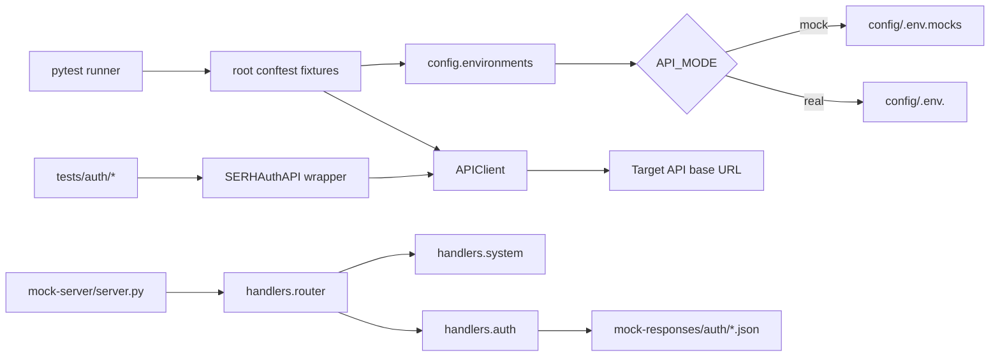

# SERH API QA Automation Framework - Technical Overview

## 1) What this repository is
This repository is a Python-based API QA framework focused on SERH authentication journeys. It combines:

- automated API tests with pytest
- a local mock server for offline and deterministic execution
- environment-driven runtime switching between mock and non-mock targets
- reusable endpoint client wrappers and common assertion helpers

The project is currently optimized for auth workflows, not for full product-domain coverage.

## 2) Core purpose and problem solved
The framework addresses two recurring QA problems:

1. Unstable integration environments: solved via a local mock server with route-level validation and deterministic stub responses.
2. Slow and inconsistent auth regression: solved via a standardized test suite covering happy path, negative, and security-oriented scenarios across auth endpoints.

It also reduces duplication by centralizing HTTP behavior, fixture setup, payload loading, and common assertions.

## 3) Architecture and design philosophy

### Design principles observed in code
- Fixture-first test architecture (session-scoped setup in root and auth-level conftest).
- Thin endpoint wrapper layer (page-object-like API classes) instead of direct HTTP calls in each test.
- Strict request-shape validation in mock handlers (required fields + unexpected-field rejection).
- Environment layering with one-time bootstrap and mode-aware config resolution.
- Controlled negative assertions: tests guard against server crashes by asserting non-5xx responses in many negative/security cases.

### Runtime architecture


## 4) Key modules and components

| Area | Component | Role in implementation |
|---|---|---|
| Environment | config/environments.py | Loads .env + mode-specific env file once per process; computes mock/real mode; exposes base URL and auth header helpers. |
| HTTP abstraction | config/http_client.py | requests.Session wrapper with URL normalization, default timeout, forced SSL verify=True, and request/response timing logs. |
| Global test bootstrap | conftest.py | Session fixtures for env load, base URL, login token acquisition, auth headers, authenticated and unauthenticated clients. |
| Auth API abstraction | tests/auth/serh_auth_api.py | 1:1 methods for /api/auth/* routes; includes helper methods for content-type and wrong-method checks. |
| Auth test fixtures | tests/auth/conftest.py | Reachability guard (socket probe), payload loader from test_data, and SERHAuthAPI fixture creation. |
| Common assertions | tests/auth/auth_test_helpers.py | Controlled error assertions, marker-aligned helpers, response JSON parsing helpers, endpoint constants. |
| Mock server entry | mock-server/server.py | ThreadingHTTPServer with centralized dispatch and JSON response serialization. |
| Mock routing | handlers/router.py | Path normalization and handler dispatch order (system first, then auth). |
| System mock handlers | handlers/system.py | /api/health and a token-gated /api/v1/users sample protected endpoint. |
| Auth mock handlers | handlers/auth.py | Validation-heavy auth route implementations, token/state/OTP checks, UAE Pass flows, and standardized error envelopes. |
| Stub payload loader | handlers/stub_loader.py | Domain-based JSON loader for mock-responses. |

## 5) Implemented features

### Test framework capabilities
- Marker taxonomy configured and used: smoke, regression, positive, negative, security.
- HTML report generation baked into pytest.ini addopts.
- Allure dependency present; report command documented.
- Environment mode switching:
	- API_MODE=mock -> loads config/.env.mocks with override
	- otherwise loads config/.env.<ENV> with fill-missing semantics
- Reachability guard skips auth suite when base host is not reachable.

### Mock-server capabilities
- Supports GET/POST/PUT/PATCH/DELETE dispatch through one request handler.
- Provides deterministic auth success responses through JSON stub files.
- Implements request header validation for auth POST routes:
	- Accept must include application/json or */*
	- Content-Type must include application/json
- Implements request body validation:
	- non-empty JSON object required
	- required fields must exist and be non-empty
	- unexpected fields are rejected

### Auth flows covered in both tests and mock routes
- Login
- Refresh token
- UAE Pass start and callback
- Forgot OTP initiate and verify
- Password reset
- Forgot email
- Account unlock

## 6) Execution workflow and control flow

### Standard execution sequence
1. pytest starts and autouse fixture calls ensure_environment_loaded().
2. Base URL is resolved from active env files.
3. auth_token fixture posts to configured login endpoint.
4. Tests run via SERHAuthAPI wrapper calls.
5. If mock mode is active and server is running, requests target local stub server.
6. For each request, APIClient logs method, URL, status, and elapsed milliseconds.
7. HTML report is generated into reports/report.html by default.

### Mock mode run pattern currently used
The workspace task "Run Pytest In Mock Mode":
- sets API_MODE=mock
- starts mock-server/server.py in a background job
- waits for /api/health readiness
- runs pytest tests/ -v
- tears down the mock job

## 7) APIs, services, integrations, and infrastructure

### Internal APIs exercised
| Endpoint | Method(s) | Implemented behavior highlights |
|---|---|---|
| /api/health | GET | Returns UP status and mock mode metadata. |
| /api/v1/users | GET | Requires fixed bearer token in mock mode. |
| /api/auth/login | POST | Validates payload shape, email format, and configured credentials. |
| /api/auth/refresh | POST | Validates JWT shape and expiry-like conditions. |
| /api/auth/uae-pass/start | GET | Returns 302 redirect with Location in mock implementation. |
| /api/auth/uae-pass/callback | POST | Validates state and Emirates ID format. |
| /api/auth/password/forgot-otp/initiate | POST | Validates email/mobile format. |
| /api/auth/password/forgot-otp/verify | POST | Validates OTP and session token constraints. |
| /api/auth/password/reset | POST | Validates token and minimum password policy. |
| /api/auth/password/forgot-email | POST | Validates email format and request shape. |
| /api/auth/account/unlock | POST | Validates email/token constraints and account-state-like outcomes. |

### External/integration touchpoints
- requests for HTTP transport.
- python-dotenv for layered environment loading.
- Optional Allure reporting integration.
- UAE Pass represented as an external auth redirect/callback contract (mocked).

No cloud infrastructure IaC, containers, or deployment manifests are implemented in this repository.

## 8) State management, data flow, and patterns
- Test state is mostly session-scoped via pytest fixtures.
- Runtime config state is process-level with one-time environment bootstrap (_ENV_LOADED flag).
- Request state is stateless per API call, except token acquisition and header reuse in fixtures.
- Mock server is effectively stateless for persistent data; route outcomes are deterministic based on payload values and hardcoded known tokens/identifiers.

Data flow pattern:
- test_data/*.json -> fixture load -> SERHAuthAPI method -> APIClient -> target endpoint
- mock-responses/auth/*.json -> handlers.stub_loader -> handler response payload

## 9) Authentication, authorization, and security behavior

### Implemented security mechanisms in framework/mocks
- Bearer token header creation helper in config.environments.get_auth_headers.
- Protected route simulation for /api/v1/users with token check.
- Negative and security tests for:
	- malformed credentials/token inputs
	- SQL-like injection strings in login payload
	- token reuse scenarios (refresh/reset/unlock)
	- invalid OAuth state for UAE Pass callback
	- content-type and accept header enforcement
	- method mismatch handling (405)

### Security caveats observed
- Mock auth logic includes hardcoded known identifiers/tokens for deterministic behavior.
- Credential checks in mock mode rely on environment values and static fallbacks.
- No secret manager integration; env vars are expected.

## 10) Build system, tooling, CI/CD, and deployment

### Build/tooling status
- No package build system (no pyproject.toml/setup.py).
- Dependency pinning through requirements.txt.
- Test execution centered on pytest.
- Reporting via pytest-html (configured) and allure-pytest (available).

### CI/CD status
- No executable CI pipeline definitions were found under .github/workflows/*.yml.
- .github/workflows/qa/feature.md and other .github docs are guidance artifacts, not runnable pipelines.

### Deployment status
- This repo is a QA/test framework and mock server, not a deployable business service.
- No Dockerfile, Kubernetes manifests, or infrastructure deployment scripts are present.

## 11) Database and schema details
- No database integration is implemented.
- No ORM, migrations, SQL scripts, or persistence layer found.
- schemas/ exists as a placeholder for request/response contracts; currently no concrete schema assets are committed.

## 12) Testing strategy and implemented coverage

### Strategy
- Auth-first vertical coverage with endpoint-specific test modules.
- Mixed scenario types:
	- positive (mostly gated for live environments through SERH_ENABLE_LIVE_POSITIVE)
	- negative validation/error handling
	- security-oriented misuse scenarios
- Smoke suite validates framework and core auth/token mechanics.

### Quantified current coverage (from repository scan)
- Total test functions in tests/: 78
- Marker occurrences:
	- regression: 73
	- negative: 56
	- positive: 9
	- security: 8
	- smoke: 5

### Coverage footprint
- Strong coverage depth in auth endpoints.
- Minimal/non-existent implementation in tests/users (package placeholder only).
- Archived legacy tests under Archieves/tests/auth indicate a refactor history.

## 13) Folder structure with implementation meaning

| Path | Practical purpose in current codebase |
|---|---|
| config/ | Environment and HTTP client runtime primitives. |
| handlers/ | Mock-server route handlers and stub loading. |
| mock-server/ | HTTP server process and local execution entrypoint. |
| mock-responses/auth/ | Active stub payloads used by auth handlers. |
| mock-responses/notifications, rbac, workflow | Planned domains with README-only placeholders. |
| tests/auth/ | Main implemented automated auth regression suite and fixtures. |
| tests/smoke/ | Core framework health and auth plumbing smoke checks. |
| tests/users/ | Placeholder for future user-domain tests. |
| test_data/ | Payload libraries and case definitions for test parameterization patterns. |
| resources/test cases/ | Manual test-case export/traceability CSV (includes execution status fields). |
| contracts/ | Contract documentation placeholder. |
| schemas/ | Schema validation asset placeholder. |
| reports/ | Generated HTML report output location. |
| Archieves/ | Archived artifacts and older test remnants. |

## 14) Extension points and customization paths

### Add a new mocked endpoint
1. Add route handling logic in handlers/auth.py or handlers/system.py (or create a new handler module).
2. Register handler in handlers/router.py dispatch sequence.
3. Add stub payload(s) in mock-responses/<domain>/.
4. Add endpoint wrapper method in tests/auth/serh_auth_api.py (or domain-specific API wrapper).
5. Add test module with marker taxonomy and shared helper assertions.

### Add real-environment scenarios
- Add/maintain config/.env.<env> files.
- Gate risky positive tests with SERH_ENABLE_LIVE_POSITIVE.
- Inject runtime credentials/tokens through environment variables, not hardcoded test payloads.

### Add schema/contract validation
- Populate schemas/ with JSON Schema or OpenAPI fragments.
- Add jsonschema-based validation assertions in tests (dependency already present).
- Wire contract assets under contracts/ and enforce in test helpers.

## 15) Current maturity and status assessment

### Maturity summary
- Stable for auth-focused API regression in mock and partially live modes.
- Good structural hygiene in fixtures, wrappers, and handler organization.
- Deterministic local execution path exists via mock server + task automation.

### Not yet production-complete as a full-platform QA framework
- CI pipeline implementation missing.
- Contract/schema enforcement scaffolded but not implemented.
- Domain breadth beyond auth is mostly placeholder.
- main.py remains template code and is not part of framework runtime.

## 16) Missing and planned capabilities (inferred)

Based on placeholders, docs, and folder topology, likely next capabilities are:

1. Schema-backed request/response validation integrated into tests.
2. Additional domain stubs/tests for workflow, RBAC, and notifications.
3. User-domain API test implementation under tests/users.
4. Runnable CI workflows (GitHub Actions or equivalent) for automated regression execution.
5. Stronger observability integration (Allure metadata enrichment and richer failure artifacts).

## 17) Practical commands

```powershell
# Install dependencies
pip install -r requirements.txt

# Start mock server
python mock-server/server.py

# Run full suite (uses pytest.ini defaults including HTML report)
pytest tests/ -v

# Run smoke
pytest tests/smoke/ -v -m smoke

# Run marker subsets
pytest tests/ -v -m regression
pytest tests/ -v -m negative
pytest tests/ -v -m security

# Optional Allure results
pytest tests/ -v --alluredir=allure-results
allure serve allure-results
```
